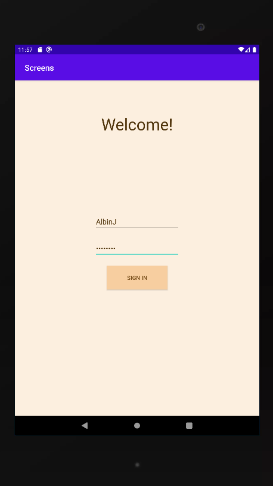
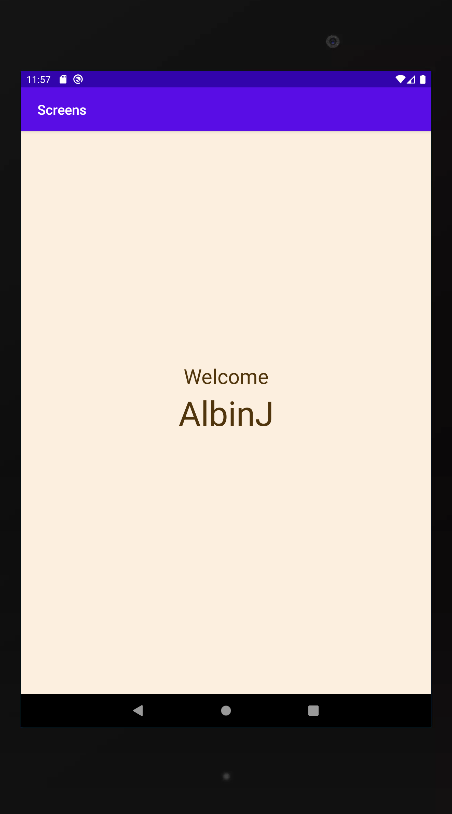

# Rapport

Denna uppgift består utav en inloggningsvy och en inloggadvy.
Appen ska simulera en inloggning visuellt men har ingen 
funtionalitet annat än att den passar över data från en sida 
till en annan.

Alla element som skulle användas drogs in i activity_main.xml.
Elementen är en titel(textView), två editText och en button.
Elementen placerades på rätt plats med hjälp utav en constraint
layout. Layouten stylades.

En empty activity skapads, denna sida fungerar som mottagare 
utav datan och består utav en textView.

Arbetet med funktionaliteten började med att skapa en variabel för knappen(signInButton) som 
ska föra användaren vidare till nästa activity och en för inputen(userName). I onCreate metoden
kopplas variablerna till elementen med hjälp av findViewById.

En eventlistener skapas som lyssnar efter klick på knappen. En funktion med namnet onClick
hanterar vad som ska ske när en användare trycker på knappen.

I onClick funktionen skapas en intent att gå från Mainactivity till LoggedIn aktiviteten.
Funtionens intent fylls även med ett key value par där kay är namn och value är innehållet i 
userName fältet.

Slutligen körs intentionen. Här är koden som hanterar funtionaliteten i activity_main vyn:

    public class MainActivity extends AppCompatActivity {
        Button signInButton;
        EditText userName;
    
        @Override
        protected void onCreate(Bundle savedInstanceState) {
            super.onCreate(savedInstanceState);
            setContentView(R.layout.activity_main);
            userName = findViewById(R.id.editTextTextPersonName);
            signInButton = findViewById(R.id.button);
            signInButton.setOnClickListener(new View.OnClickListener() {
                @Override
                public void onClick(View view) {
                    Intent intent = new Intent(MainActivity.this, LoggedIn.class);
                    intent.putExtra("name", userName.getText().toString()); // Optional
                    startActivity(intent);
                }
            });
        }
    }

Nu tar funktionaliteten som tillhör den andra vyn över(activity_logged_in.xml). Funtionaliteten
finns i LoggedIn.java. En variabel deklareras för den textView som datan(användarnamnet) ska 
skrivas ut på. I onCreate metoden tilldelas denna variabeln elementet med hjälp utav 
findViewById.

En if-sats kollar om det finns några värden att hämta i extras, om så är fallet deklareras
en sträng som innehåller användarnamnet som passats vidare från intenten. Denna sträng används
i så fall som text i textViewn.

    public class LoggedIn extends AppCompatActivity {
    
        TextView userNameTextView;
    
        @Override
        protected void onCreate(Bundle savedInstanceState) {
            super.onCreate(savedInstanceState);
            setContentView(R.layout.activity_logged_in);
            userNameTextView = findViewById(R.id.userNameTextField);
            Bundle extras = getIntent().getExtras();
            if (extras != null) {
                String name = extras.getString("name");
                userNameTextView.setText(name);
    
            }
        }
    }

Detta är resultatet.
Screen 1

Screen 2
